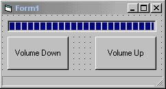

## Easy Volume Control

### Description

A great Volume Control code. Very easy and very reliable.
 
### More Info
 
You don't need anything..No Ocx, No Long Codes..just simple codeing, which is easy to master.

             |
---                |---
**Submitted On**   |2000-10-18 20:20:10
**By**             |[Elvir Bahtijaragic](https://github.com/Planet-Source-Code/PSCIndex/blob/master/ByAuthor/elvir-bahtijaragic.md)
**Level**          |Beginner
**User Rating**    |3.2 (16 globes from 5 users)
**Compatibility**  |VB 6\.0
**Category**       |[Sound/MP3](https://github.com/Planet-Source-Code/PSCIndex/blob/master/ByCategory/sound-mp3__1-45.md)
**World**          |[Visual Basic](https://github.com/Planet-Source-Code/PSCIndex/blob/master/ByWorld/visual-basic.md)
**Archive File**   |[CODE\_UPLOAD1076810182000\.zip](https://github.com/Planet-Source-Code/elvir-bahtijaragic-easy-volume-control__1-12140/archive/master.zip)

